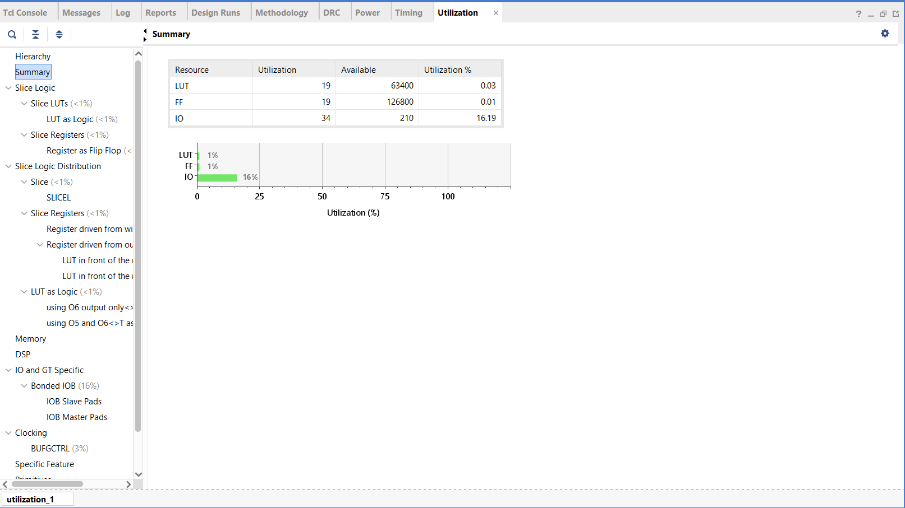
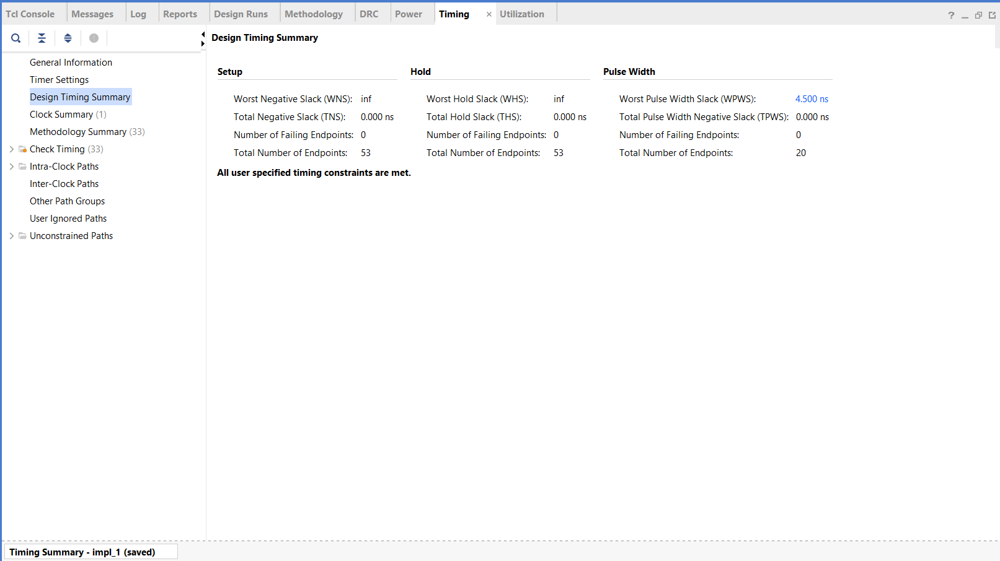
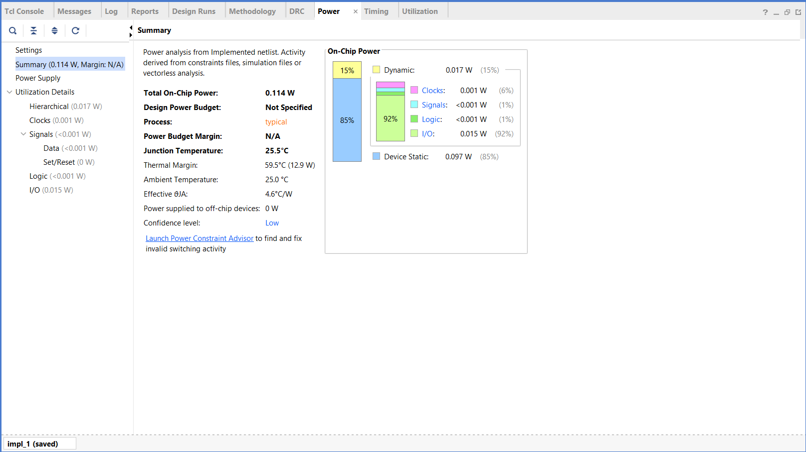
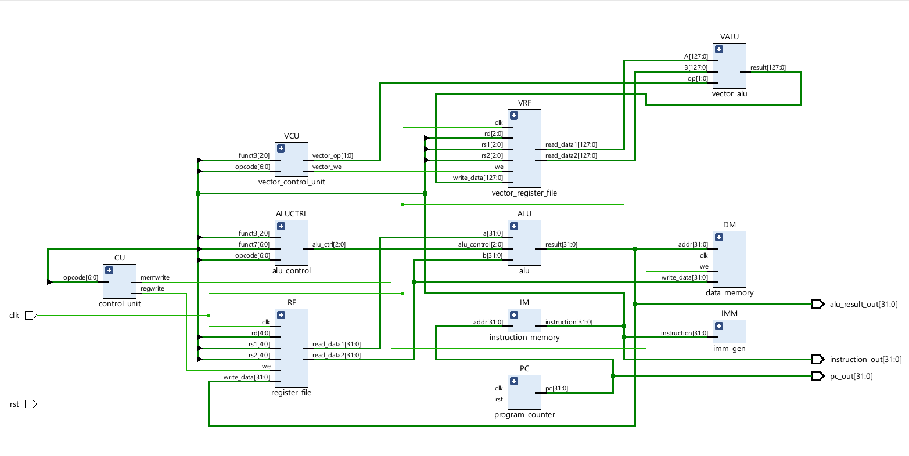
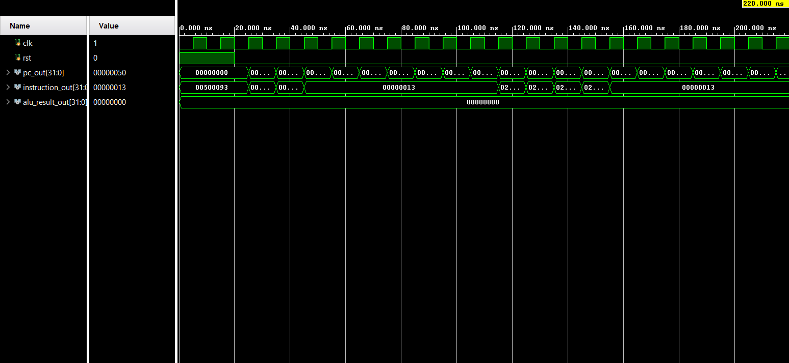
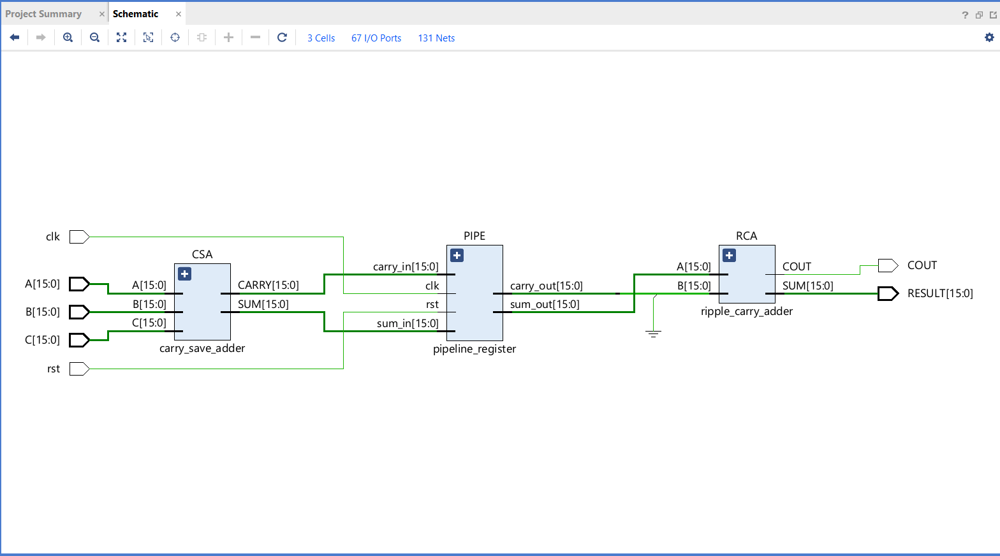

# Optimized Pipelined Carry-Save Adder (PCSA) for 16-Bit Cryptographic Arithmetic Units

> Design and FPGA Implementation of a High-Throughput 16-bit Pipelined Carry-Save Adder for Cryptographic Arithmetic

<p align="left">
  
  
  
  
  
</p>

---

## Overview

This project presents the design and implementation of an **Optimized Pipelined Carry-Save Adder (PCSA)** for **16-bit cryptographic arithmetic units**. The architecture is designed to improve computational throughput by combining **Carry-Save Addition (CSA)** with a **single-stage pipelined architecture**, separating partial addition from the final carry propagation stage.

The design was developed using **Verilog HDL**, verified through **behavioral simulation**, and synthesized using **Xilinx Vivado 2025.2** targeting the **Xilinx Artix-7 FPGA** family.

This work also resulted in a **published Indian Patent** and was presented at **ETCC 2026**, an IEEE-associated international conference.

---

## Project Impact

- 🇮🇳 **Published Indian Patent** based on the PCSA architecture.
- 🎤 **Presented at ETCC 2026**, an IEEE-associated International Conference.
- ⚡ Demonstrates the complete FPGA design flow from RTL design through synthesis, implementation, timing analysis, resource analysis, power estimation, and bitstream generation.
- 🔒 Serves as a reusable arithmetic building block for cryptographic hardware.

---

## Table of Contents

- [Overview](#overview)
- [Project Impact](#project-impact)
- [Motivation](#motivation)
- [Features](#features)
- [Project Status](#project-status)
- [Architecture](#architecture)
- [Technologies Used](#technologies-used)
- [Repository Structure](#repository-structure)
- [Synthesis and FPGA Implementation Results](#synthesis-and-fpga-implementation-results)
- [Simulation Results](#simulation-results)
- [Applications](#applications)
- [Verification](#verification)
- [RTL Schematic](#rtl-schematic)
- [Simulation Waveform](#simulation-waveform)
- [Synthesized Design](#synthesized-design)
- [Resource Utilization](#resource-utilization)
- [Timing Summary](#timing-summary)
- [Power Analysis](#power-analysis)
- [Recognition](#recognition)
- [Running the Project](#running-the-project)
- [Future Improvements](#future-improvements)
- [Reports](#reports)
- [Conclusion](#conclusion)
- [License](#license)

---

## Motivation

Arithmetic operations form the foundation of modern cryptographic systems. Traditional **Ripple Carry Adders (RCA)** suffer from long carry propagation delays, while conventional **Carry Save Adders (CSA)** still require a final carry propagation stage.

This project introduces a **single-stage pipelined CSA architecture** that improves throughput while maintaining efficient FPGA resource utilization.

---

## Features

- 16-bit Carry Save Adder architecture
- Single-stage pipelined datapath
- Modular Verilog RTL implementation
- Behavioral simulation in Xilinx Vivado
- RTL Elaboration
- RTL Synthesis
- FPGA resource utilization analysis
- Timing summary generation
- Power analysis
- FPGA implementation
- Bitstream generation
- Hardware-oriented modular design

---

## Project Status

| Stage | Status |
|--------|:------:|
| RTL Design | ✅ |
| Behavioral Simulation | ✅ |
| RTL Elaboration | ✅ |
| RTL Synthesis | ✅ |
| FPGA Implementation | ✅ |
| Resource Analysis | ✅ |
| Timing Analysis | ✅* |
| Power Analysis | ✅ |
| Bitstream Generation | ✅ |
| Documentation | ✅ |

> \* Timing analysis was completed, but no user-defined clock constraint was applied; therefore, maximum operating frequency and formal timing closure are not established by the current report.

---

## Architecture

```text
          A
          B
          C
          │
          ▼
+----------------------+
| Carry Save Adder     |
+----------------------+
          │
          ▼
+----------------------+
| Pipeline Register    |
+----------------------+
          │
          ▼
+----------------------+
| Ripple Carry Adder   |
+----------------------+
          │
          ▼
      RESULT, COUT
```

The architecture performs partial addition using a Carry Save Adder, stores intermediate values in a pipeline register, and completes carry propagation through a Ripple Carry Adder to improve throughput.

---

## Technologies Used

- Verilog HDL
- Xilinx Vivado 2025.2
- Xilinx Artix-7 FPGA
- Digital Logic Design
- FPGA Design Flow

---

## Repository Structure

```text
Optimized-Pipelined-Carry-Save-Adder/
│
├── rtl/
├── testbench/
├── reports/
├── diagrams/
│   ├── rtl_schematic.png
│   ├── behavioral_waveform.png
│   ├── utilization.png
│   ├── timing_summary.png
│   └── power_summary.png
├── simulation/
├── elaborated_design.png
├── README.md
└── LICENSE
```

---

## Synthesis and FPGA Implementation Results

The PCSA design was successfully synthesized and implemented in **Xilinx Vivado 2025.2** targeting the **Xilinx Artix-7 XC7A100TCSG324-1** FPGA device used by the Nexys A7 platform.

### FPGA Resource Utilization

| Resource | Utilization | Available | Utilization % |
|----------|------------:|----------:|--------------:|
| LUT | **19** | 63,400 | **0.03%** |
| Flip-Flop | **19** | 126,800 | **0.01%** |
| I/O | **34** | 210 | **16.19%** |

The implementation uses a very small fraction of the available LUT and flip-flop resources, demonstrating a compact RTL implementation suitable for FPGA-based arithmetic acceleration.

<p align="center">
    
</p>

*Figure 1. Post-implementation FPGA resource utilization reported by Xilinx Vivado.*

---

### Timing Analysis

The implemented design contains **53 timing endpoints** and reports no failing endpoints.

| Metric | Result |
|--------|-------:|
| Timing Constraints | **No user-defined clock constraint** |
| WNS | **N/A** |
| TNS | **0.000 ns** |
| WHS | **N/A** |
| THS | **0.000 ns** |
| Failing Endpoints | **0** |
| Timing Endpoints | **53** |

> **Timing Note:** No user-defined clock constraint was applied during the current implementation. Therefore, WNS/WHS values are not interpreted as maximum-frequency or timing-closure results. A target clock constraint should be added in a future revision to perform meaningful setup/hold timing analysis.

<p align="center">
    
</p>

*Figure 2. Vivado implementation timing summary.*

---

### Power Analysis

Vivado estimated the following on-chip power for the implemented design:

| Metric | Result |
|--------|-------:|
| Total On-Chip Power | **0.114 W** |
| Dynamic Power | **0.017 W** |
| Device Static Power | **0.097 W** |
| Junction Temperature | **25.5°C** |
| Ambient Temperature | **25.0°C** |
| Thermal Margin | **59.5°C** |

<p align="center">
    
</p>

*Figure 3. Vivado estimated power analysis.*

> **Power Note:** These values are Vivado estimates from the implemented design and are not measured board-level power consumption. The report indicates a low confidence level, so the results should be treated as an implementation estimate rather than a hardware measurement.

---

## Simulation Results

The design was verified using **behavioral simulation** in Xilinx Vivado.

### Test Vectors

| A | B | C | Result |
|---:|---:|---:|---:|
| 10 | 20 | 30 | 60 |
| 100 | 200 | 300 | 600 |
| 1024 | 2048 | 4096 | 7168 |
| 65535 | 1 | 0 | Overflow |

---

## Applications

- Cryptographic processors
- Modular arithmetic units
- FPGA accelerators
- High-speed arithmetic hardware
- Digital Signal Processing (DSP)

---

## Verification

The complete design flow was successfully executed and verified through simulation, synthesis, implementation, resource analysis, timing analysis, and power estimation.

- ✔ Behavioral Simulation completed
- ✔ RTL Elaboration successful
- ✔ RTL Synthesis successful
- ✔ FPGA Implementation completed
- ✔ Resource Utilization generated
- ✔ Timing Summary generated
- ✔ Power Analysis generated
- ✔ Bitstream Generation completed
- ✔ No synthesis errors

---

## RTL Schematic

<p align="center">
  
</p>

*Figure 10. Vivado timing summary.*

---

## Simulation Waveform

<p align="center">
  
</p>

*Figure 11. Vivado estimated power report.*

---

## Synthesized Design

<p align="center">
  
</p>

*Figure 6. Elaborated RTL design.*

---

## Resource Utilization

<p align="center">
  
</p>

*Figure 7. FPGA resource utilization after synthesis.*

### Key Observations

- Efficient utilization of FPGA resources.
- Minimal logic consumption.
- Suitable for lightweight arithmetic acceleration.

---

## Timing Summary

<p align="center">
  
</p>

*Figure 8. Vivado timing summary.*

### Timing Results

| Metric | Value |
|--------|------:|
| Worst Negative Slack (WNS) | **N/A** |
| Total Negative Slack (TNS) | **0.000 ns** |
| Worst Hold Slack (WHS) | **N/A** |
| Total Hold Slack (THS) | **0.000 ns** |
| Failing Endpoints | **0** |
| Total Endpoints | **53** |

The design completed synthesis and implementation without failing endpoints; however, no user-defined timing constraints were applied, so formal timing closure and maximum operating frequency cannot be determined from the current report.

---

## Power Analysis

<p align="center">
  
</p>

*Figure 9. Vivado estimated power report.*

| Metric | Value |
|--------|------:|
| Total Estimated Power | **0.114 W** |
| Dynamic Power | **0.017 W** |
| Static Power | **0.097 W** |
| Junction Temperature | **25.5°C** |
| Ambient Temperature | **25.0°C** |

> **Note:** This power report is based on Vivado's vectorless power estimation. The unusually high I/O power is an estimation artifact and should not be interpreted as measured hardware power.

---

## 🏆 Recognition

### 🇮🇳 Published Indian Patent

This project resulted in a published Indian Patent.

| Item | Details |
|------|---------|
| **Patent Title** | Optimized Pipelined Carry-Save Adder (PCSA) |
| **Application No.** | 202641018710 |
| **Publication No.** | IN202641018710 A1 |

<p align="center">
  
  
</p>

---

### 🎤 ETCC 2026 Conference Presentation

The research based on this project was presented at:

- **Conference:** ETCC 2026 – International Conference on Emerging Technologies in Computing and Communication
- **Host:** PES University EC Campus, Bengaluru
- **Technical Association:** IEEE Bangalore Section, IEEE Computer Society Bangalore Chapter, and IEEE Communications Society Bangalore Chapter

<p align="center">
  
  
</p>

---

## Running the Project

### Requirements

- Xilinx Vivado 2025.2 (or compatible version)

### Steps

1. Clone the repository.
2. Open Xilinx Vivado.
3. Create a new RTL Project.
4. Add all files from the `rtl/` directory as **Design Sources**.
5. Add `testbench/pcsa_tb.v` as a **Simulation Source**.
6. Set `pcsa_top` as the **Top Module**.
7. Run **Behavioral Simulation**.
8. Run **RTL Elaboration**.
9. Run **Synthesis**.
10.  Run **Implementation**.
11.  Review **Resource Utilization**.
12.  Review **Timing Summary**.
13.  Review **Power Analysis**.
14.  Generate the **Bitstream**.

---

## Contributions

Contributions, issues, and feature requests are welcome.

If you identify improvements, feel free to open an issue or submit a pull request.

---

## Future Improvements

- 32-bit implementation
- 64-bit implementation
- Carry Lookahead-based final adder
- ASIC implementation
- UVM verification environment

---

## Reports

The following synthesis reports are included in the `reports/` directory.

- `utilization_report.rpt`
- `timing_summary.rpt`

---

## Conclusion

The proposed **16-bit Optimized Pipelined Carry-Save Adder** was successfully designed, simulated, elaborated, synthesized, implemented, and bitstream-generated using **Verilog HDL** and **Xilinx Vivado**.

The modular pipelined architecture demonstrates improved computational throughput while maintaining efficient FPGA resource utilization. The project's impact extends beyond implementation through a **published Indian Patent** and an **ETCC 2026 conference presentation**, demonstrating its relevance to cryptographic hardware research and FPGA-based digital design.

---

## Author

**Akshaj Gandi**

Electronics and Communication Engineering

SRM Institute of Science and Technology

---

## License

This project is released under the **MIT License**. See the `LICENSE` file for details.

---

## Support

If you found this project useful, consider giving the repository a ⭐.
